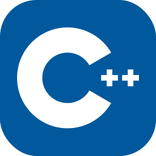
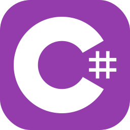
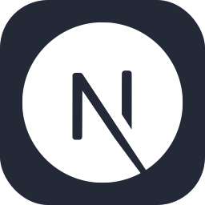

<h1 align="center">Hi there, I'm Lucas 👋</h1>

🧑‍💻 I'm a young programmer looking to share and learn new things.

## 🚀 Languages:

## 🛠️ Tools:

 

<picture>
  <source media="(prefers-color-scheme: dark)" srcset="https://raw.githubusercontent.com/eurmn/eurmn/output/github-contribution-grid-snake-dark.svg" />
  <source media="(prefers-color-scheme: light)" srcset="https://raw.githubusercontent.com/eurmn/eurmn/output/github-contribution-grid-snake.svg" />
  
</picture>

 

## 📝 My Projects / Meus Projetos:
### Web Dev / Desenvolvimento Web:
 - [⭐ scrabr - Scrabble em português brasileiro](https://github.com/eurmn/scrabr)
 - [pomodorify](https://github.com/euromoon/pomodorify)
 - [Sample Website](https://github.com/euromoon/sample-website-1)
 - [musicolor](https://github.com/euromoon/musicolor)
 - [watchit](https://github.com/euromoon/watchit)
### Backend
 - [Telegram GPT3 Chatbot](https://github.com/euromoon/telegram-gpt3-chatbot)
 - [Gtools Web (Fullstack - Backend em Golang)](https://github.com/euromoon/GTools-Web)
### Android
 - [oquecomer](https://github.com/euromoon/oquecomer)
